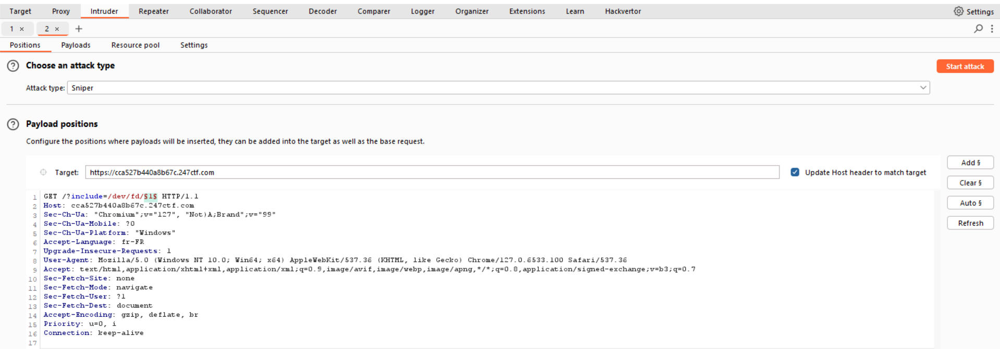
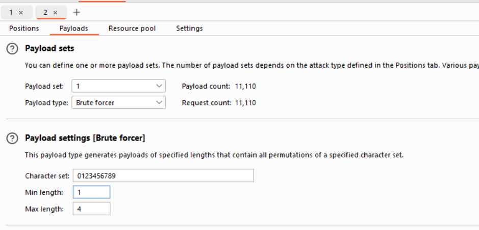

# FORGOTTEN FILE POINTER (web)
##Intro

This is my write-up for the web challenge "FORGOTTEN FILE POINTER" on the CTF site 247CTF.com.

## Challenge Details

The challenge involves finding a way to read and print the flag through path traversal.

## Steps to Solve

### 1. Access the Application

Start by accessing the web application provided for the challenge.

### 2. Analyze the Provided Code

php
Copier le code
<?php
  $fp = fopen("/tmp/flag.txt", "r");
  if($_SERVER['REQUEST_METHOD'] === 'GET' && isset($_GET['include']) && strlen($_GET['include']) <= 10) {
    include($_GET['include']);
  }
  fclose($fp);
  echo highlight_file(__FILE__, true);
?>
Steps to Solve

1. Understanding and Identifying the Vulnerability

The vulnerability in this PHP code is Local File Inclusion (LFI).

The include function allows user-controlled input to determine which file is included. The length check (strlen($_GET['include']) <= 10) is a weak security measure that can be bypassed. It will prevent us from reading flag.txt directly via path traversal.

We know that the file is still open in the system; the provided code doesn’t close it. Thus, we need to find a way to use the pointer of the opened file flag.txt that is shorter than 10.

With some Google research about path traversal, LFI, and file descriptors, I found the following information:

In Linux, everything is stored as a file somehow. For example, /proc is sometimes referred to as a process information pseudo-file system. It doesn’t contain 'real' files but runtime system information.

[Stack Overflow on file descriptors](https://stackoverflow.com/questions/36429787/how-do-i-copy-or-move-remote-files-with-phpseclib/36558913#36558913)

[Quora on file descriptors](https://www.quora.com/Where-do-file-descriptors-get-stored-in-Linux#:~:text=The%20file%20descriptor%20will%20get,%2Ffd”.&text=Once%20you%20find%20the%20process,the%20list%20of%20open%20files)

I discovered that every file is open at /proc/$PID/fd/$fd, but we don’t know the process ID. Thus, we need to navigate to /dev/fd/$fd, which is often a symbolic link to /proc/self/fd/$fd.

### 2. Exploiting the Vulnerability

Now we know that the ?include=/dev/fd/$fd parameter points to our flag file, but we don’t know the value of $fd. We can brute force it using Burp Suite.

First, capture the request, select the $fd, and send it to Intruder.

Second, adjust the payload parameter to brute force.

Once we find the $fd, just visit the response, and you’ll find the flag.

Resources that helped me in my search

[HackMD on file descriptors](https://hackmd.io/@Chivato/rkj-Y1GVI)
